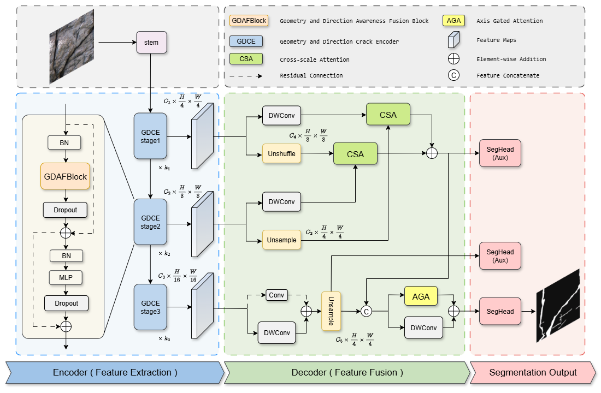

## GDAFNet: A Lightweight Geometry and Direction Awareness Attention Fusion Network for Rock-Mass Crack Segmentation
## Abstract
 Rock-mass crack segmentation is crucial for geological hazard analysis and structural safety monitoring, yet remains challenging due to the slender geometry, weak contrast, and anisotropic appearance of cracks under complex field conditions. To address these issues, we propose GDAFNet, a lightweight Geometry and Direction Awareness Fusion Network that incorporates geometric priors and oriented texture modeling to enhance the discrimination of fine crack structures. The core GDAFBlock integrates Diagonal Aggregation Convolution (DAC) with a Multi-Directional Perception Module (MDPM) to strengthen the extraction of horizontal, vertical, and diagonal crack patterns. In addition, the HCAFDecoder employs hierarchical gated cross-attention with axis-aware refinement to improve semantic coherence and preserve the continuity of slender crack traces. Extensive experiments on the public CrackSeg9k dataset and our newly collected GHCrack(Geological Hazard Crack) dataset demonstrate that GDAFNet achieves 82.64\% mIoU and 82.38\% mIoU, respectively—surpassing classical CNNs, lightweight Transformer-based models, and crack-specific architectures. With only 0.59M parameters, GDAFNet delivers strong performance and is highly suitable for deployment on resource-constrained monitoring devices. These results highlight the importance of geometry and direction awareness feature modeling for crack segmentation and provide a practical and robust solution for real-world geological hazard monitoring applications and engineering safety applications.

## Model Architecture


## 📁 Project Structure

```plaintext
.
├── 📂 fig/                    # Model structure diagram
│   └── overview.pdf       
├── 📂 model/                  # Model architecture definition directory
│   └── our_model.py           # Core model implementation from the paper
└── 📜 README.md               # This file
